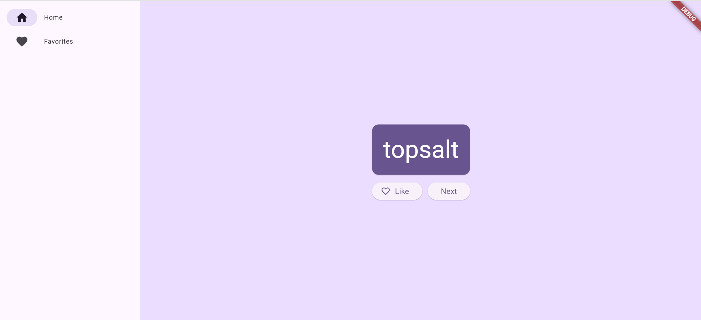
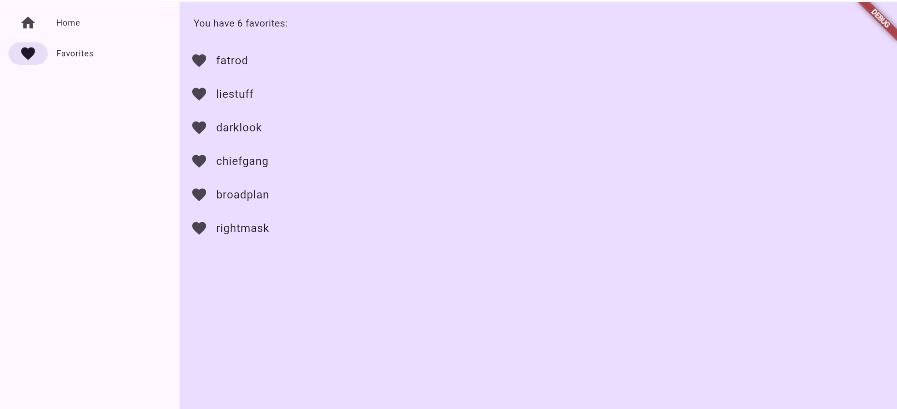
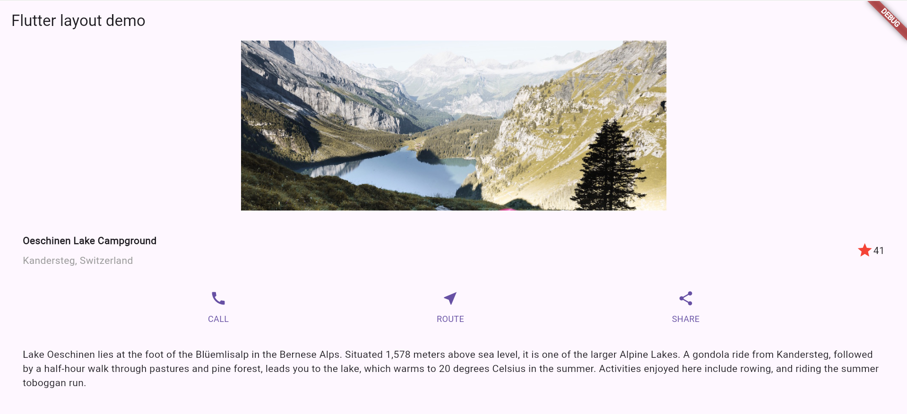
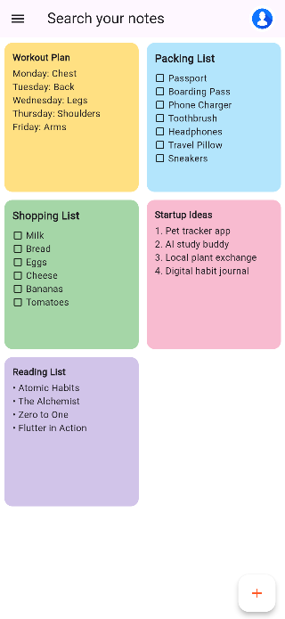

# Assignment-1-UI-Composition – GROUP 4

## Group Members
- Hamad Naseem (2280143)
- Muhammad Bin Tariq (2280150)
- Rehan Badshah - (2280159)

---

## Assignment Overview

This repository contains all four parts of our Flutter UI Composition Assignment, built using Dart and Flutter.
Each part demonstrates different aspects of Flutter UI design, layout, and component structuring.

---

## 🔹 Part 1 – Namer App
A startup name generator app following the official Flutter tutorial. Includes infinite list generation and favorite saving functionality using Provider.

### Screenshots
| Home Page                    | Favorites Page                      |
| ---------------------------- | ----------------------------------- |
|  |  |


---

## 🔹 Part 2 – Layout Tutorial
A custom Flutter layout based on the official Flutter Layout tutorial. Demonstrates usage of Rows, Columns, and Containers.

### Screenshots 


---

## 🔹 Part 3 – Programming Hub UI Clone
A replica of the Programming Hub app home screen. Focuses on composition, font styling, and card UI.

### Screenshots  


---

## 🔹 Part 4 – Keep App UI Clone
A recreation of the Keep App (Google Notes) screen. Demonstrates use of GridView, custom components, and responsive layout.

### Screenshots 


---

## 🚀 Getting Started

To run any part:

```bash
cd partX_folder
flutter pub get
flutter run
