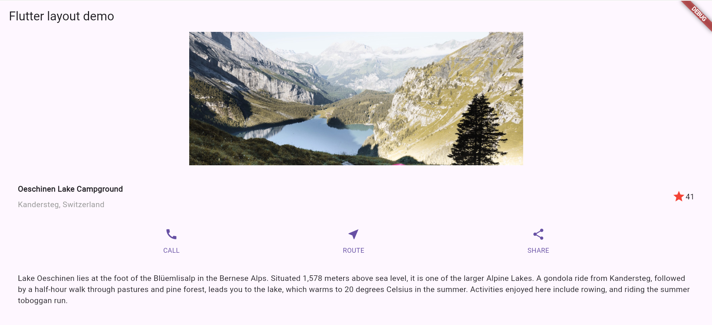

# Flutter Layout App - Part 2

## Description

This project is Part 2 of the UI Composition assignment. It focuses on recreating a layout using Flutter widgets based on the official Flutter layout tutorial.

---

## Overview

The app layout includes:

- A scenic image (lake)
- A title section with location and rating
- A row of action buttons (Call, Route, Share)
- A text section with a description
- Scroll support for smaller screens

All elements are arranged using Flutter's core layout widgets.

---

## Features

- Scrollable layout for small screens
- Custom button section
- Clean and readable widget structure
- Asset image integration

---

## Screenshots

### Original Image  

### Final Output   

---

## Getting Started

1. Clone the repository or download the ZIP.
2. Run `flutter pub get`.
3. Launch the app using `flutter run` on an emulator or physical device.

---

## Reference

- [Flutter Layout Tutorial](https://docs.flutter.dev/development/ui/layout/tutorial)
