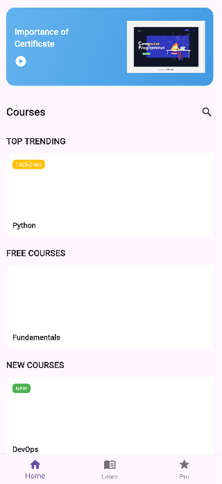
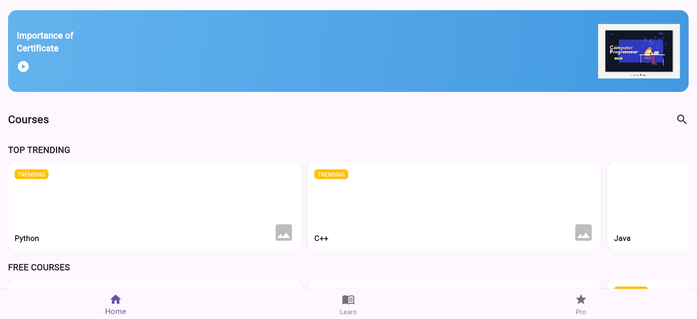
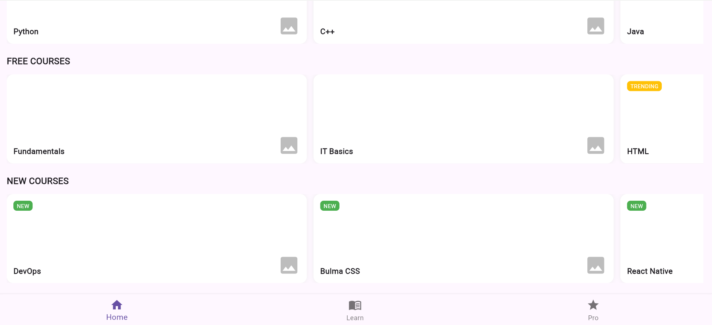

# part3_programming_hub

A sleek, minimal UI clone of the Programming Hub app built using Flutter. The app showcases horizontal scrolling course cards, section titles, and a bottom navigation bar — optimized for both mobile and web views.

## Features

- Modern and responsive UI
- Mobile + Web layout support
- Categorized course sections (Trending, Free, New)
- Custom bottom navigation bar
- Local image assets with fallback icon support

## Screenshots

### Mobile View


### Web View 1 (Header + Top Trending)


### Web View 2 (Free + New Courses)


## Getting Started

1. Clone this repo:
   ```bash
    git clone https://github.com/hamad-naseem/Assignment-1-UI-Composition.git
   cd programming-hub-ui

2. Get dependencies:
    ```bash
    flutter pub get

3. Run the app:
    ```bash
    flutter run -d chrome 

## Getting Started

This project is a starting point for a Flutter application.

A few resources to get you started if this is your first Flutter project:

- [Lab: Write your first Flutter app](https://docs.flutter.dev/get-started/codelab)
- [Cookbook: Useful Flutter samples](https://docs.flutter.dev/cookbook)

For help getting started with Flutter development, view the
[online documentation](https://docs.flutter.dev/), which offers tutorials,
samples, guidance on mobile development, and a full API reference.
