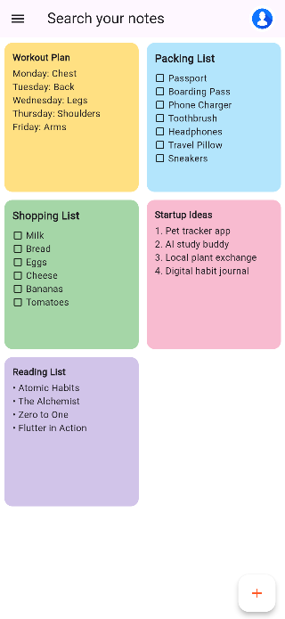

# Part 4 Google Keep Clone – Flutter UI

A lightweight Flutter UI project that mimics the Google Keep app layout. This app focuses on beautiful UI composition using Flutter widgets like GridView, Card, and custom reusable components.

---

### Features

* Responsive Grid Layout
* Checklist and Note Cards
* Reusable Widgets for Notes
* Floating Action Button (FAB)
* AppBar with Search and Profile Icon

---

### Screenshots

| 

---

### Getting Started

1. Clone this repository:

   ```bash
    git clone https://github.com/hamad-naseem/Assignment-1-UI-Composition.git
   cd part4_keep
   ```

2. Get dependencies:

   ```bash
   flutter pub get
   ```

3. Run the app:

   ```bash
   flutter run
   ```

---

📄 License
This project is for educational purposes only.

---

## Getting Started

This project is a starting point for a Flutter application.

A few resources to get you started if this is your first Flutter project:

- [Lab: Write your first Flutter app](https://docs.flutter.dev/get-started/codelab)
- [Cookbook: Useful Flutter samples](https://docs.flutter.dev/cookbook)

For help getting started with Flutter development, view the
[online documentation](https://docs.flutter.dev/), which offers tutorials,
samples, guidance on mobile development, and a full API reference.
